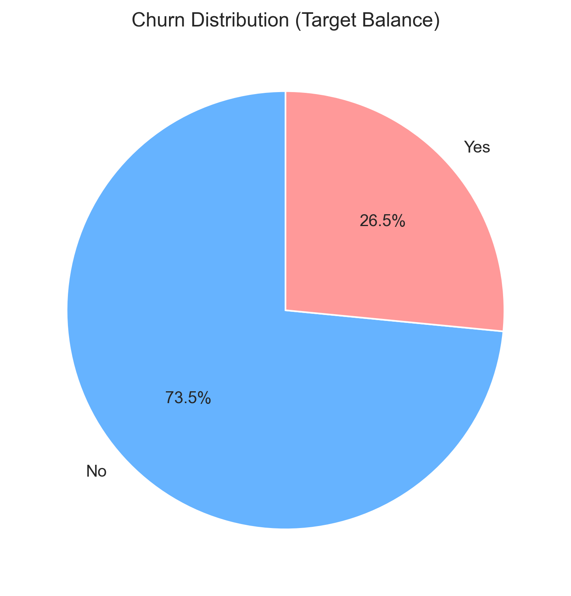
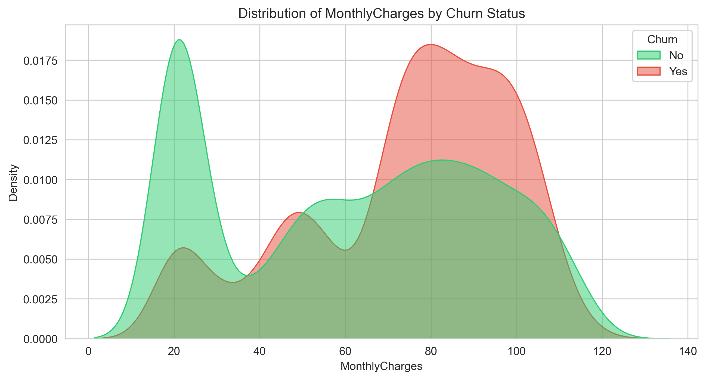
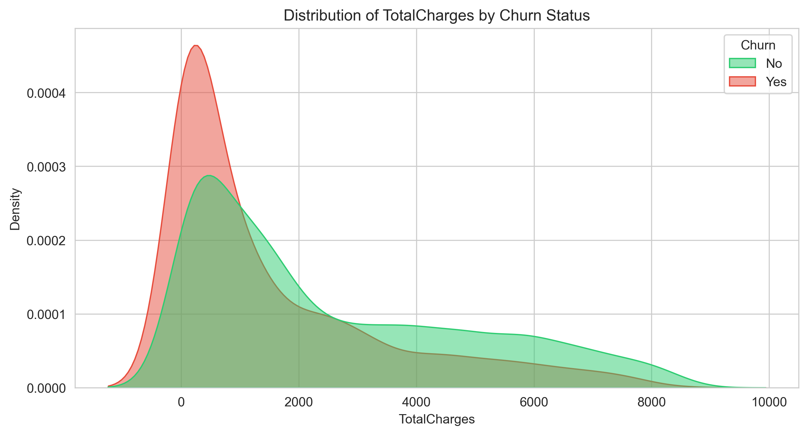
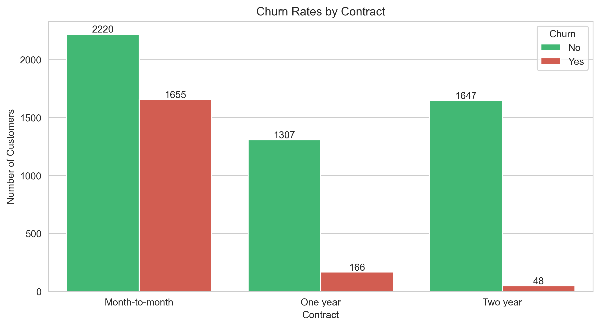
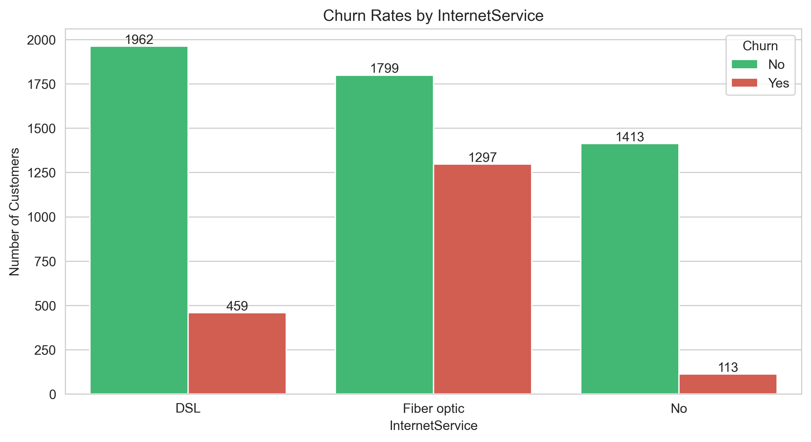
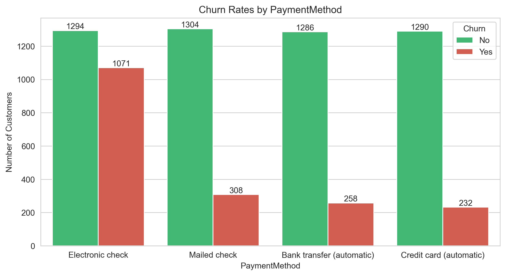
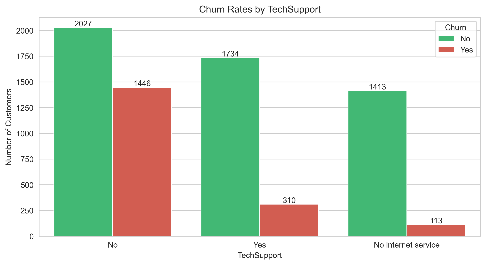
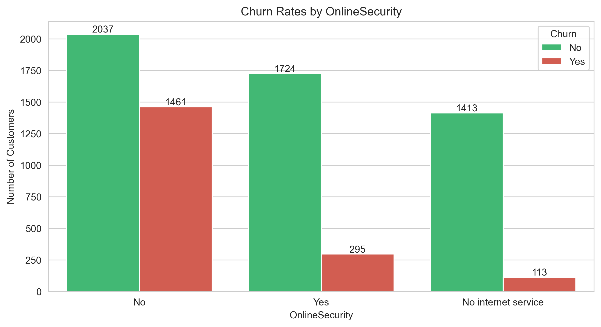

# 📉 Customer Churn Prediction & Retention Analysis System

---

## 🔗 Live Deployment

The system is deployed on **Streamlit Cloud**, allowing interactive churn prediction and actionable retention insights.  

**Live App:** [https://customer-churn-prediction-and-retention-analysis-system.streamlit.app](https://customer-churn-prediction-and-retention-analysis-system.streamlit.app)

---

## 📊 Dataset

**Telecom customer churn dataset**

The dataset includes **customer demographics, account information, service usage, and churn label**, enabling predictive modeling and business insights.

---

## 📈 Exploratory Data Analysis (EDA)

### 🔹 01_churn_distribution.png – Target Balance Pie Chart
  
**Insight:** Churn is imbalanced; most customers are retained. This emphasizes the importance of recall-focused evaluation and techniques like SMOTE for handling class imbalance.

### 🔹 02_dist_tenure.png – Customer Tenure Distribution
  
**Insight:** Customers with shorter tenure are more likely to churn, highlighting the need for early retention strategies.

### 🔹 02_dist_MonthlyCharges.png – Monthly Charges Distribution
  
**Insight:** Customers paying higher monthly charges tend to churn more, possibly due to perceived cost vs. value.

### 🔹 02_dist_TotalCharges.png – Total Charges Distribution
  
**Insight:** Low total charges are often linked to early churn, while high total charges usually belong to long-term retained customers.

### 🔹 03_cat_Contract.png – Contract Type Analysis
  
**Insight:** Month-to-month customers have the highest churn risk, suggesting incentives for longer contracts could improve retention.

### 🔹 03_cat_InternetService.png – Internet Service Type Analysis
  
**Insight:** Fiber Optic customers show higher churn, likely due to service expectations not being met.

### 🔹 03_cat_PaymentMethod.png – Payment Method Analysis
  
**Insight:** Customers using electronic checks churn more frequently; switching them to automatic payments could improve retention.

### 🔹 03_cat_TechSupport.png – Tech Support Usage
  
**Insight:** Customers without tech support are more likely to leave, indicating service support is a retention driver.

### 🔹 03_cat_OnlineSecurity.png – Online Security Service
  
**Insight:** Customers without online security are at higher churn risk, suggesting cross-selling premium services could help retain them.

### 🔹 04_correlation_matrix.png – Correlation Heatmap
  
**Insight:** Tenure and total charges are strongly correlated; engineered features like AvgMonthlySpend and ServiceCount improve predictive performance.

---

## 🤖 Machine Learning Workflow

1. **Data Cleaning & Preprocessing** – Handle missing values, convert data types, encode categorical features.  
2. **Feature Engineering** – Create AvgMonthlySpend, ServiceCount, TenureGroup, ContractRiskScore.  
3. **Imbalance Handling** – Apply SMOTE to balance churn vs retained customers.  
4. **Model Training** – Logistic Regression, Random Forest, XGBoost.  
5. **Evaluation** – Accuracy, Precision, Recall, F1-score, ROC-AUC.  
6. **Interpretability** – Feature importance and SHAP explanations.  
7. **Deployment** – Interactive Streamlit app for real-time predictions.

---

## 💡 Key Insights & Recommendations

- **Main drivers of churn:** Contract type, payment method, monthly charges, tenure, service engagement (Tech Support, Online Security).  
- **Retention strategies:**  
  - Offer long-term contracts or loyalty programs for month-to-month customers.  
  - Promote add-on services to increase perceived value.  
  - Target high-risk groups with personalized retention campaigns.  

---

## 🛠️ Technologies Used

- **Programming:** Python 3.9+  
- **Data Processing:** Pandas, NumPy  
- **Visualization:** Matplotlib, Seaborn  
- **Machine Learning:** Scikit-learn, XGBoost  
- **Imbalanced Data Handling:** Imbalanced-learn (SMOTE)  
- **Deployment:** Streamlit Cloud  
- **Model Persistence:** Joblib  
